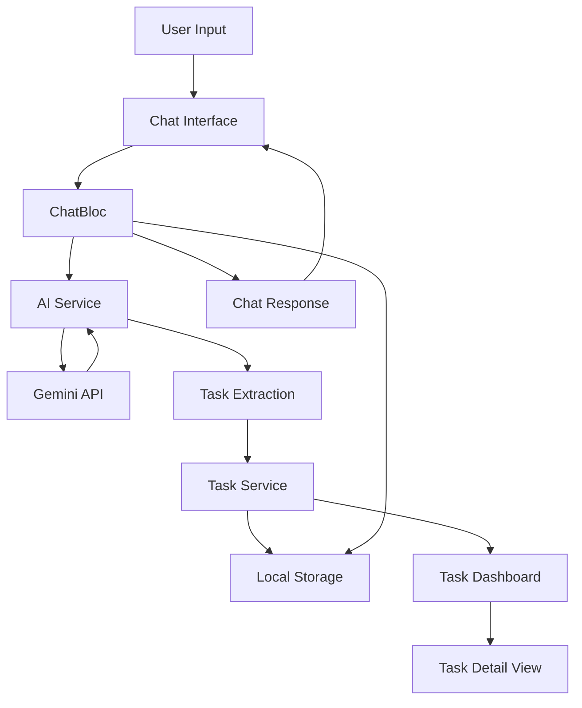
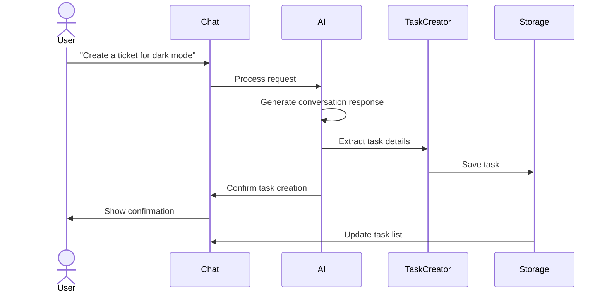

# Ell-ena: AI-Powered Product Manager Assistant

Ell-ena is an intelligent AI assistant built to streamline product management workflows. Using natural language processing powered by Google's Gemini API, Ell-ena automates task creation, categorization, and management — all through a simple conversational interface.

---

## 🌟 Features

- **Natural Language Task Creation**: Create tasks by simply chatting with Ell-ena  
- **Intelligent Categorization**: Automatically categorizes work into To-Dos, Tickets, and Meeting Notes  
- **Context-Aware Responses**: Maintains conversation history to provide relevant assistance  
- **Task Management**: View, organize, and track task completion through an intuitive dashboard  
- **Priority & Deadline Tracking**: Automatically extracts and tracks priorities and due dates  
- **Team Integration**: Designed to integrate with broader team management flows  

---

## 📊 System Architecture


### 🔄 Task Creation Flow



## Prerequisites
- **Flutter SDK** (3.7.2 or newer)  
- **Dart SDK** (2.19.0 or newer)  
- **Google Gemini API key**

## Installation
1. Clone the repository  
2. Install dependencies  
3. Configure your API key  
4. Create a `.env` file in the project root  
5. Add your Gemini API key:
    ```env
    GEMINI_API_KEY=your_key_here
    ```
6. Run the app

---

# 💬 How to Use Ell-ena

## Creating Tasks Through Chat
Simply tell Ell-ena what you need in natural language:

> "Create a task for the design review meeting tomorrow at 2pm"  
> "Add a ticket for implementing dark mode with high priority"  
> "I need to finish the quarterly report by Friday"

Ell-ena will process your request, create an appropriately categorized task, and send a confirmation.

## Managing Tasks
- **Dashboard View**: See an overview of your tasks, counts by type, and upcoming deadlines  
- **Task Lists**: Filter tasks by type (To-Do, Ticket, Meeting Note)  
- **Task Details**: Tap on any task to see complete details and related tasks  
- **Task Actions**: Mark tasks as complete, delete tasks, or update task details  

---

# 🔍 Technical Implementation

## Core Components
- **Flutter & Dart**: Cross-platform UI framework  
- **BLoC Pattern**: State management using the Business Logic Component pattern  
- **Gemini API**: Google's large language model for natural language understanding  
- **Local Storage**: Persistent data storage using SharedPreferences  

## Key Engineering Decisions
- **Two-Stage AI Processing**: Conversational response + structured task extraction  
- **Specialized Task Extraction Prompt**: Reliable structured data retrieval  
- **Context Window Management**: Efficient use of conversation history  
- **Smart Task Type Mapping**: Flexible interpretation of natural input  
- **Chat Message Metadata Linking**: Interactive confirmations linked to tasks  

---

# 📱 Integration with Team Management

- **Team Chat Integration**: Extracts action items from team discussions  
- **Resource Suggestions**: Recommends relevant resources based on task context  
- **Task Assignment**: Creates assigned tasks for team members  
- **Progress Tracking**: Visual indicators of task completion rates  
- **Meeting Note Transcription**: Captures and structures notes from meetings  

---

# 📋 Task Model

| Property       | Description                                |
|----------------|--------------------------------------------|
| **Title**      | Concise description of the task            |
| **Description**| Detailed explanation                       |
| **Type**       | To-Do, Ticket, or Meeting Note             |
| **Priority**   | Low, Medium, High, or Urgent               |
| **Due Date**   | When the task should be completed          |
| **Tags**       | Keywords for organization and search       |
| **Status**     | In progress or completed                   |
| **Related Tasks** | Links to connected work items           |

---

# 🧠 AI System Prompt

> You are **Ell-ena**, an AI-powered product manager assistant.  
> Your job is to help users manage tasks, create tickets, and transcribe meetings.  
> When users ask you to create tasks or tickets, understand their request and respond accordingly.

### Example Requests:
- "Create a task for the design review meeting tomorrow"  
- "Add a ticket for implementing dark mode"  
- "Add a to-do item for completing my assignment by Friday"

Include relevant details in your responses and always be helpful, concise, and professional.

**Task Types:**
1. **To-Do items** – Simple tasks  
2. **Tickets** – Feature/bug work items  
3. **Meeting Notes** – Summaries and action items from meetings

When working with tasks, try to include details about **priority**, **deadlines**, and **relevant context**.

---
## 📬 Contact

For questions, reach out at euclidstellar@gmail.com.
